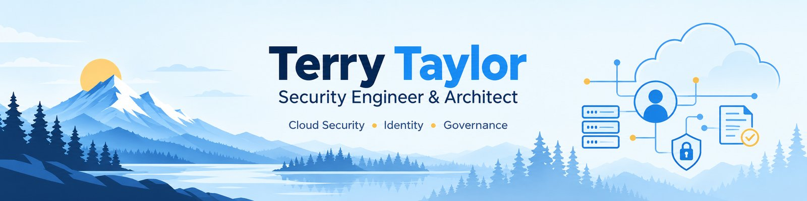
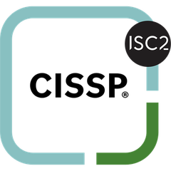
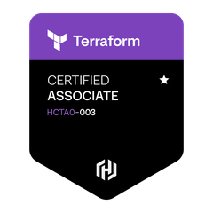
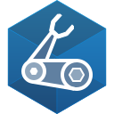

<picture>
  <source media="(prefers-color-scheme: dark)" srcset="assets/profile-header-dark.jpg">
  
</picture>

Security engineer and architect in Seattle, working across **cloud
security, identity, infrastructure, and security automation**.

I build the controls and systems behind security programs, not only
the requirements around them. Thirteen years across enterprise and
regulated environments, from infrastructure engineering and
Severity-A cloud support through staff-level security architecture
and program leadership. I have taken two organizations from
Cybersecurity Maturity Model Certification gap assessment through
successful certification.

Most of the engineering work here is part of
[control-plane](https://tltaylor1.github.io), a security engineering
program built in public. Plans are written before implementation,
AI-assisted changes are gated and human-reviewed, engineering claims
are tested, and mistakes become rules rather than disappearing into
commit history.

If you like the program (control-plane) or the main application
(role-call), a star tells me it was useful.

### Featured projects

| Project | What it does |
|---|---|
| [role-call](https://github.com/tltaylor1/role-call) | Governance for AWS non-human identities: the roles, service accounts, and access keys that are easy to create and easy to forget. It derives identity state from observed history, adds ownership and explainable risk findings, and turns that evidence into governed review decisions. The software recommends; a person decides. |
| [build-doctrine](https://github.com/tltaylor1/build-doctrine) | An enforceable engineering rulebook for AI-assisted software development. Every rule traces back to a real failure and names the check that prevents it from recurring. The repository can score another project, vet outside code, and scaffold new projects with the gates in place from the first commit. |
| [control-plane](https://tltaylor1.github.io) | The program surrounding the individual projects: plans before code, human-reviewed agent changes, blocking gates, monitoring, recovery exercises, architectural decisions, and a record of failures and what changed because of them. |
| [secure-expense-mvp](https://github.com/tltaylor1/secure-expense-mvp) | A deliberately small application that carries application security end to end: object-level authorization, bounded file handling, transactional audit records, dependency integrity, security-gated delivery, and tests proven by deliberately breaking the controls they protect. |

### Design and architecture

| Project | What it is |
|---|---|
| [sample-diagrams](https://github.com/tltaylor1/sample-diagrams) | Architecture and process diagrams showing how I communicate systems, trust boundaries, data flows, operational workflows, and cross-team handoffs. |

### References and study tools

| Project | What it is |
|---|---|
| [aws-azure-security-mapping](https://github.com/tltaylor1/aws-azure-security-mapping) | Ninety-nine AWS security concepts mapped to their closest Azure counterparts, including the cases where the two platforms have no clean equivalent. |
| [anki-decks](https://github.com/tltaylor1/anki-decks) | Seven maintained study decks, 1,262 cards across PowerShell, Python, KQL, Bicep, cybersecurity, the AWS Security Specialty, and compliance frameworks. Each deck also has a plain CSV source so changes can be reviewed in Git. |

<b>Certifications</b>

<table align="center"><tr>
  <td align="center"><a href="https://www.isc2.org/certifications/cissp" title="ISC2 Certified Information Systems Security Professional"><picture><source media="(prefers-color-scheme: dark)" srcset="assets/badges/cissp-dark.png"></picture> CISSP</a></td>
  <td align="center"><a href="https://learn.microsoft.com/en-us/credentials/certifications/cybersecurity-architect-expert/" title="Microsoft Certified: Cybersecurity Architect Expert"> Cybersecurity Architect Expert</a></td>
  <td align="center"><a href="https://learn.microsoft.com/en-us/credentials/certifications/azure-solutions-architect/" title="Microsoft Certified: Azure Solutions Architect Expert"> Azure Solutions Architect Expert</a></td>
  <td align="center"><a href="https://learn.microsoft.com/en-us/credentials/certifications/m365-administrator-expert/" title="Microsoft 365 Certified: Administrator Expert"> Microsoft 365 Administrator Expert</a></td>
  <td align="center"><a href="https://developer.hashicorp.com/certifications/infrastructure-automation" title="HashiCorp Certified: Terraform Associate"> Terraform Associate</a></td>
  <td align="center"><a href="https://www.cisco.com/site/us/en/learn/training-certifications/certifications/enterprise/ccna/index.html" title="Cisco Certified Network Associate"><picture><source media="(prefers-color-scheme: dark)" srcset="assets/badges/ccna-dark.png"></picture> CCNA</a></td>
</tr></table>

<b>Skills and tools</b>

  
  
  
  
  
  
  
  

  
  
  
  
  
  
  

### Areas of focus

**Cloud security.** Azure, AWS, Microsoft 365, secure landing zones,
network segmentation, private connectivity, cloud security
architecture.

**Identity and zero trust.** Entra ID, Conditional Access, PIM,
non-human identities, workload identities, managed identities, service
principals, SAML, OIDC, OAuth 2.0.

**Security engineering and automation.** Terraform, Bicep, Python,
PowerShell, KQL, policy as code, CI/CD security gates, secure-by-design
engineering.

**Detection and observability.** Microsoft Sentinel, Splunk, Cribl,
Defender, CloudTrail, GuardDuty, log pipelines, detection engineering,
threat hunting.

**Governance and compliance.** CMMC, NIST 800-171, NIST 800-53,
FedRAMP, CIS Benchmarks, architecture reviews, control implementation,
continuous monitoring.

---

The projects here are meant to be inspected. Design decisions, rejected
alternatives, tests, controls, and failures are kept visible so the
implementation can be evaluated rather than simply trusted.
